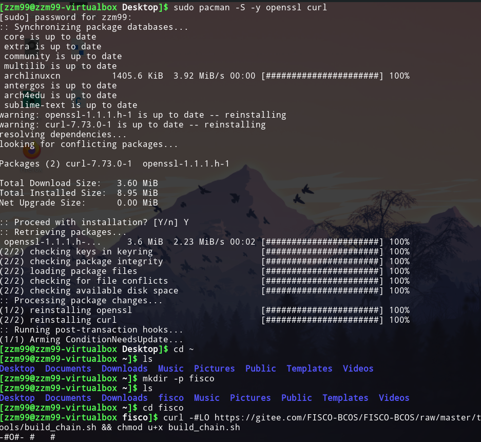
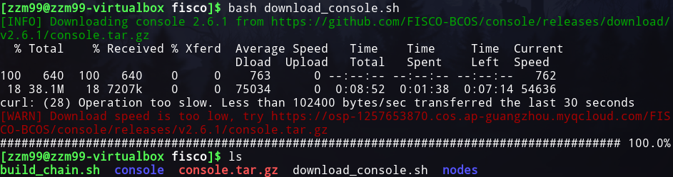
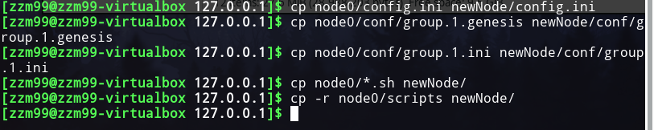

# 前期热身报告

<!-- TOC -->

- [前期热身报告](#前期热身报告)
  - [任务需求](#任务需求)
  - [实验环境](#实验环境)
  - [环境安装](#环境安装)
    - [单群组FISCO BCOS联盟链的搭建](#单群组fisco-bcos联盟链的搭建)
    - [配置及使用控制台](#配置及使用控制台)
    - [部署及调用HelloWorld合约](#部署及调用helloworld合约)
      - [HelloWorld合约](#helloworld合约)
      - [部署HelloWorld合约](#部署helloworld合约)
      - [调用HelloWorld合约](#调用helloworld合约)
  - [任务一：使用已有的开源区块链系统 FISCO-BCOS，完成私有链的搭建以及新节点的加入。](#任务一使用已有的开源区块链系统-fisco-bcos完成私有链的搭建以及新节点的加入)
  - [任务二：自行编写一个智能合约并部署到私有链上，同时完成合约调用。](#任务二自行编写一个智能合约并部署到私有链上同时完成合约调用)
  - [任务三：使用命令查看一个区块，并对各个字段进行解释](#任务三使用命令查看一个区块并对各个字段进行解释)

<!-- /TOC -->

## 任务需求

- 任务一：使用已有的开源区块链系统 FISCO-BCOS，完成私有链的搭建以及新节点的加入。
- 任务二：自行编写一个智能合约并部署到私有链上，同时完成合约调用。
- 任务三：使用命令查看一个区块，并对各个字段进行解释

## 实验环境

- virtualbox下的manjaro linux

## 环境安装

### 单群组FISCO BCOS联盟链的搭建

安装依赖以及下载build_chain.sh



搭建单群组4节点联盟链，在fisco目录下执行下面的指令，生成一条单群组4节点的FISCO链。 请确保机器的30300~30303，20200~20203，8545~8548端口没有被占用。


启动FISCO BCOS链，启动所有节点：


检查进程，检查进程是否启动：


检查日志输出：

查看节点node0链接的节点数


检查是否在共识


### 配置及使用控制台

安装Java


获取控制台并回到fisco目录




拷贝控制台配置文件


配置控制台证书


启动控制台


使用控制台获取信息


### 部署及调用HelloWorld合约

#### HelloWorld合约

HelloWorld合约提供两个接口，分别是get()和set()，用于获取/设置合约变量name。合约内容如下:

```js
pragma solidity ^0.4.24;

contract HelloWorld {
    string name;

    function HelloWorld() {
        name = "Hello, World!";
    }

    function get()constant returns(string) {
        return name;
    }

    function set(string n) {
        name = n;
    }
}
```

#### 部署HelloWorld合约

为了方便用户快速体验，HelloWorld合约已经内置于控制台中，位于控制台目录下contracts/solidity/HelloWorld.sol，参考下面命令部署即可。在控制台输入以下指令 部署成功则返回合约地址。


#### 调用HelloWorld合约

查看当前块高


调用get接口获取name变量 此处的合约地址是deploy指令返回的地址


查看当前块高，块高不变，因为get接口不更改账本状态


调用set设置name


再次查看当前块高，块高增加表示已出块，账本状态已更改


调用get接口获取name变量，检查设置是否生效


退出控制台


## 任务一：使用已有的开源区块链系统 FISCO-BCOS，完成私有链的搭建以及新节点的加入。

私有链的搭建部分在上面`环境安装/单群组FISCO_BCOS联盟链搭建`部分已经完成。

下面完成新节点的加入，即为上面生成的私有链新增一个共识节点。

- 获取证书生成脚本

尝试 `curl -#LO https://gitee.com/FISCO-BCOS/FISCO-BCOS/raw/master/tools/gen_node_cert.sh`


- 生成新节点私钥证书

```shell
# -c指定机构证书及私钥所在路径
# -o输出到指定文件夹，其中newNode/conf中会存在机构agency新签发的证书和私钥
bash gen_node_cert.sh -c ../cert/agency -o newNode
```


- 拷贝群组1中节点node0配置文件与工具脚本



- 更新newNode/config.ini中监听的IP和端口，对于`[rpc]`模块，修改listen_ip、channel_listen_port和jsonrpc_listen_port；对于`[p2p]`模块，修改listen_port
- 将新节点的P2P配置中的IP和Port加入原有节点的config.ini中的`[p2p]`字段。假设新节点IP:Port为127.0.0.1:30304则，修改后的`[P2P]`配置为


- 启动所有节点（四个）：


- 通过console将新节点加入群组1（控制台使用addSealer）, nodeID可以通过命令cat newNode/conf/node.nodeid来获取:

获取新节点nodeid：


- 使用控制台addSealer根据新节点的nodeID设置为共识节点；


- 使用控制台getSealerList查询共识节点中是否包含新节点的nodeID，如存在，加入群组操作完成：


## 任务二：自行编写一个智能合约并部署到私有链上，同时完成合约调用。

创建一个Asset.sol智能合约于console/contracts/solidity目录下。


其功能为：
- 能够在区块链上进行资产注册
- 能够实现不同账户的转账
- 可以查询账户的资产金额

```js
pragma solidity ^0.4.24;

import "./Table.sol";

contract Asset {
    // event
    event RegisterEvent(int256 ret, string account, uint256 asset_value);
    event TransferEvent(int256 ret, string from_account, string to_account, uint256 amount);

    constructor() public {
        // 构造函数中创建t_asset表
        createTable();
    }

    function createTable() private {
        TableFactory tf = TableFactory(0x1001);
        // 资产管理表, key : account, field : asset_value
        // |  资产账户(主键)      |     资产金额       |
        // |-------------------- |-------------------|
        // |        account      |    asset_value    |
        // |---------------------|-------------------|
        //
        // 创建表
        tf.createTable("t_asset", "account", "asset_value");
    }

    function openTable() private returns(Table) {
        TableFactory tf = TableFactory(0x1001);
        Table table = tf.openTable("t_asset");
        return table;
    }

    /*
    描述 : 根据资产账户查询资产金额
    参数 ：
            account : 资产账户

    返回值：
            参数一： 成功返回0, 账户不存在返回-1
            参数二： 第一个参数为0时有效，资产金额
    */
    function select(string account) public constant returns(int256, uint256) {
        // 打开表
        Table table = openTable();
        // 查询
        Entries entries = table.select(account, table.newCondition());
        uint256 asset_value = 0;
        if (0 == uint256(entries.size())) {
            return (-1, asset_value);
        } else {
            Entry entry = entries.get(0);
            return (0, uint256(entry.getInt("asset_value")));
        }
    }

    /*
    描述 : 资产注册
    参数 ：
            account : 资产账户
            amount  : 资产金额
    返回值：
            0  资产注册成功
            -1 资产账户已存在
            -2 其他错误
    */
    function register(string account, uint256 asset_value) public returns(int256){
        int256 ret_code = 0;
        int256 ret= 0;
        uint256 temp_asset_value = 0;
        // 查询账户是否存在
        (ret, temp_asset_value) = select(account);
        if(ret != 0) {
            Table table = openTable();

            Entry entry = table.newEntry();
            entry.set("account", account);
            entry.set("asset_value", int256(asset_value));
            // 插入
            int count = table.insert(account, entry);
            if (count == 1) {
                // 成功
                ret_code = 0;
            } else {
                // 失败? 无权限或者其他错误
                ret_code = -2;
            }
        } else {
            // 账户已存在
            ret_code = -1;
        }

        emit RegisterEvent(ret_code, account, asset_value);

        return ret_code;
    }

    /*
    描述 : 资产转移
    参数 ：
            from_account : 转移资产账户
            to_account ： 接收资产账户
            amount ： 转移金额
    返回值：
            0  资产转移成功
            -1 转移资产账户不存在
            -2 接收资产账户不存在
            -3 金额不足
            -4 金额溢出
            -5 其他错误
    */
    function transfer(string from_account, string to_account, uint256 amount) public returns(int256) {
        // 查询转移资产账户信息
        int ret_code = 0;
        int256 ret = 0;
        uint256 from_asset_value = 0;
        uint256 to_asset_value = 0;

        // 转移账户是否存在?
        (ret, from_asset_value) = select(from_account);
        if(ret != 0) {
            ret_code = -1;
            // 转移账户不存在
            emit TransferEvent(ret_code, from_account, to_account, amount);
            return ret_code;

        }

        // 接受账户是否存在?
        (ret, to_asset_value) = select(to_account);
        if(ret != 0) {
            ret_code = -2;
            // 接收资产的账户不存在
            emit TransferEvent(ret_code, from_account, to_account, amount);
            return ret_code;
        }

        if(from_asset_value < amount) {
            ret_code = -3;
            // 转移资产的账户金额不足
            emit TransferEvent(ret_code, from_account, to_account, amount);
            return ret_code;
        }

        if (to_asset_value + amount < to_asset_value) {
            ret_code = -4;
            // 接收账户金额溢出
            emit TransferEvent(ret_code, from_account, to_account, amount);
            return ret_code;
        }

        Table table = openTable();

        Entry entry0 = table.newEntry();
        entry0.set("account", from_account);
        entry0.set("asset_value", int256(from_asset_value - amount));
        // 更新转账账户
        int count = table.update(from_account, entry0, table.newCondition());
        if(count != 1) {
            ret_code = -5;
            // 失败? 无权限或者其他错误?
            emit TransferEvent(ret_code, from_account, to_account, amount);
            return ret_code;
        }

        Entry entry1 = table.newEntry();
        entry1.set("account", to_account);
        entry1.set("asset_value", int256(to_asset_value + amount));
        // 更新接收账户
        table.update(to_account, entry1, table.newCondition());

        emit TransferEvent(ret_code, from_account, to_account, amount);

        return ret_code;
    }
}
```


部署到私有链上：


合约调用：

注册Alice和Bob


查询资产


资产转移


## 任务三：使用命令查看一个区块，并对各个字段进行解释

通过help命令查看到关于了解区块信息的函数如下：


下面使用getBlockByNumber来获取一个区块：（根据区块高度获取区块信息：）


各个字段的含义如下：

- transactions：交易列表
- number：区块高度（本区块的块号，块号从0号开始计算）
- hash： 区块哈希，区块头前13个字段RLP编码后的哈希值，FISCO BCOS新增字段
- parentHash：父区块的哈希值
- logsBloom：交易收据日志组成的Bloom过滤器，FISCO BCOS目前尚未使用
- transactionsRoot：交易树的根哈希值
- receiptsRoot：收据树的根哈希值
- dbHash：分布式存储通过计算哈希值来记录一区块中写入的数据，FISCO BCOS新增字段
- stateRoot：状态树的根哈希值
- sealer：打包区块的节点在共识节点列表中的索引，FISCO BCOS新增字段
- sealerList： 区块的共识节点列表（不含观察节点），FISCO BCOS新增字段
- extraData：附加数据
- gasLimit：本区块中所有交易消耗的Gas上限
- gasUsed：本区块中所有交易使用的Gas之和
- timestamp：打包区块的unix时间戳
- signatureList：区块的附加数据，FISCO BCOS目前只用于在第0块中记录群组genesis文件信息

