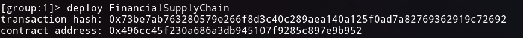
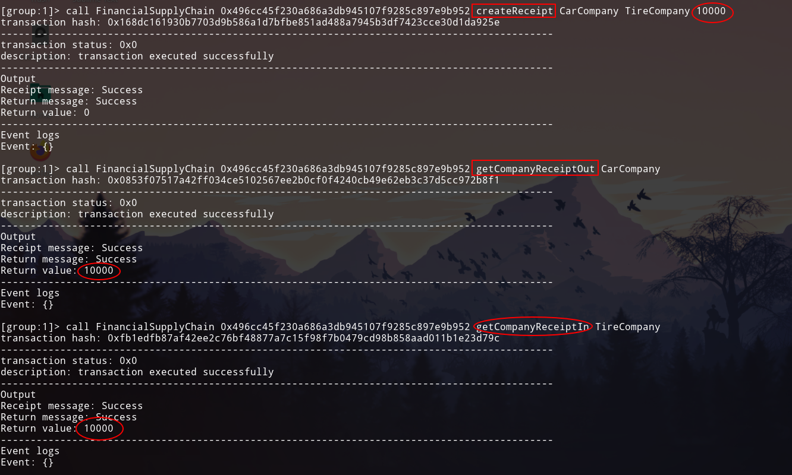
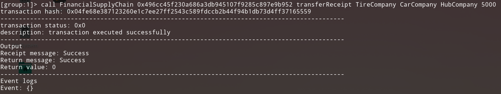
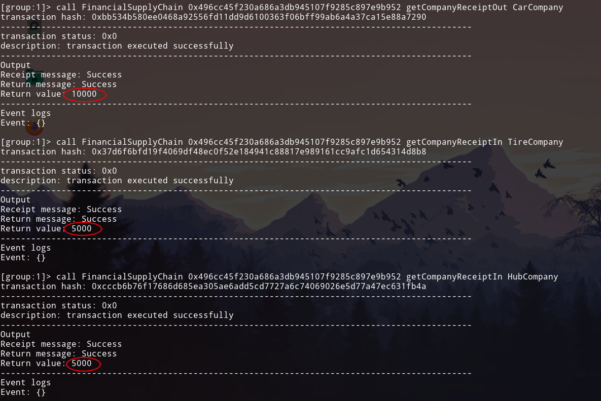
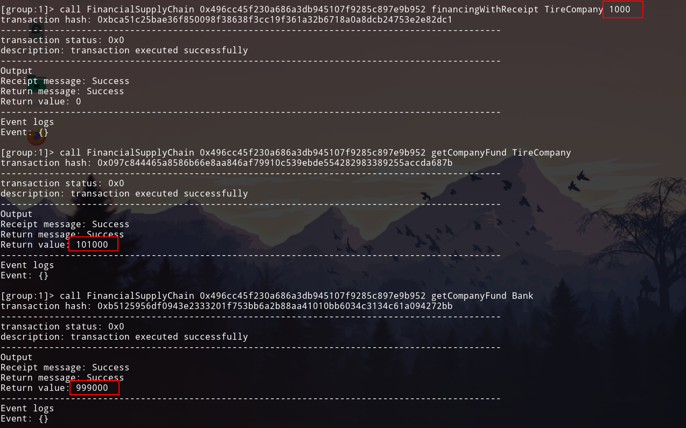
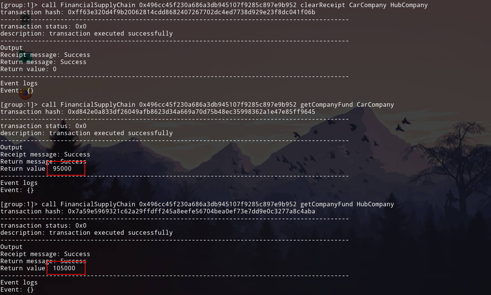
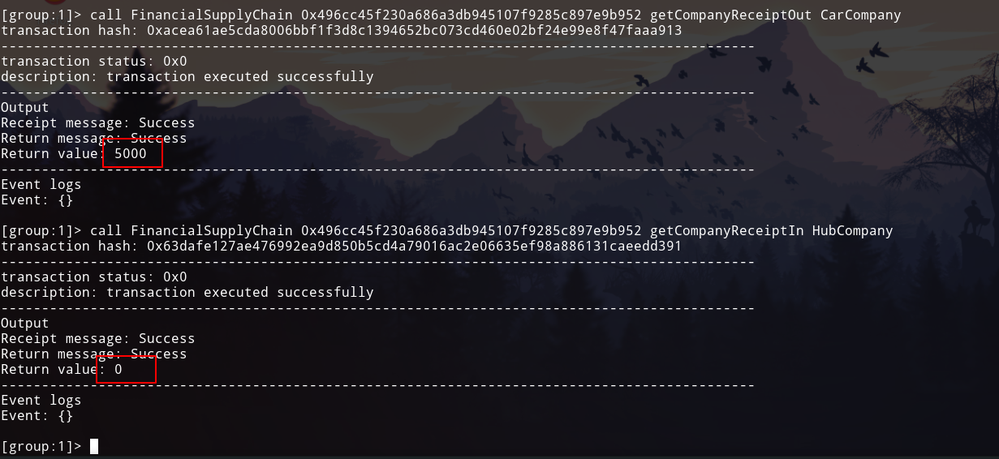

# 功能测试文档

- 郑卓民 18342138	
- 张展邦 18342134	
- 颜府 18342113

> 将智能合约部署至链上（单节点 or 多节点），并调用相关函数，详细说明上述的四个功能具体是如何实现的。

智能合约的部署：

- 功能一：实现采购商品—签发应收账款交易上链。例如车企从轮胎公司购买一批轮胎并签订应收账款单据。

由下图可见，车企买了10000块轮胎，并签订单据，此时，车企单据支出10000（以后要支付的），轮胎公司单据收入10000（以后将收入的）。

- 功能二：实现应收账款的转让上链，轮胎公司从轮毂公司购买一笔轮毂，便将于车企的应收账款单据部分转让给轮毂公司。轮毂公司可以利用这个新的单据去融资或者要求车企到期时归还钱款。

结合上面功能一的测试，由下图可见，轮胎公司将从车企那里拿到的应收账款单据转让了5000给轮毂公司，此时车企账单应付10000，轮胎公司账单应收5000，轮毂公司账单应收5000。

- 功能三：利用应收账款向银行融资上链，供应链上所有可以利用应收账款单据向银行申请融资。

结合上面功能一二的测试，由下图可见，轮胎公司利用从车企那里拿到的应收账款单据5000，向银行融资了1000元，此时银行的资产减少1000，轮胎公司的资产增加1000。（轮胎公司初始化资产有100000，银行初始化资产有1000000，融资后，轮胎公司资产为101000，银行资产为999000）。

- 功能四：应收账款支付结算上链，应收账款单据到期时核心企业向下游企业支付相应的欠款。

结合上面功能一二三的测试，由下图可见，前面车企欠了轮毂公司5000块，下图进行清理账款，清理之后，车企的资产减少5000，轮毂公司资产增加5000。（车企初始化资产有100000，轮毂公司初始化资产有100000，清理账款后，车企资产95000，轮毂公司资产105000）。

此外，由于车企偿还了部分账单，所以车企应付账单金额减少5000（即：10000-5000=5000），轮毂公司应收账单金额减少5000（即清零了：5000-5000=0）。

