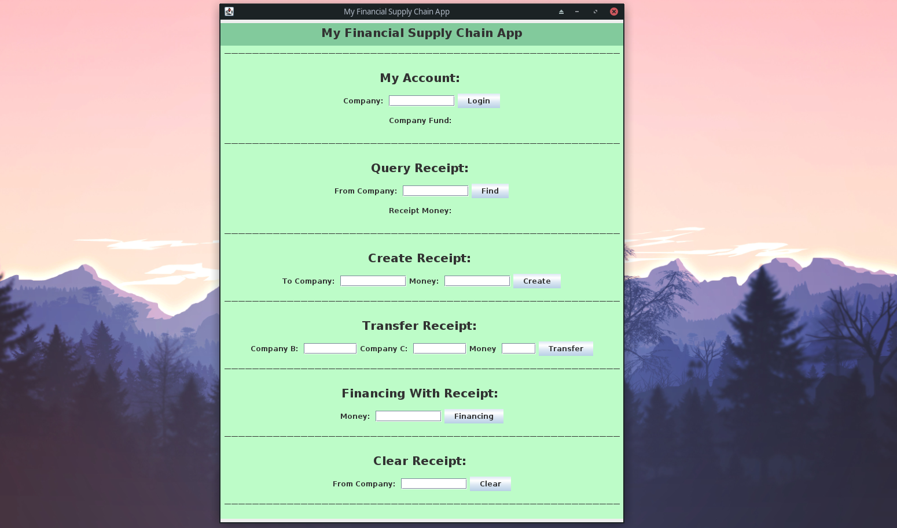
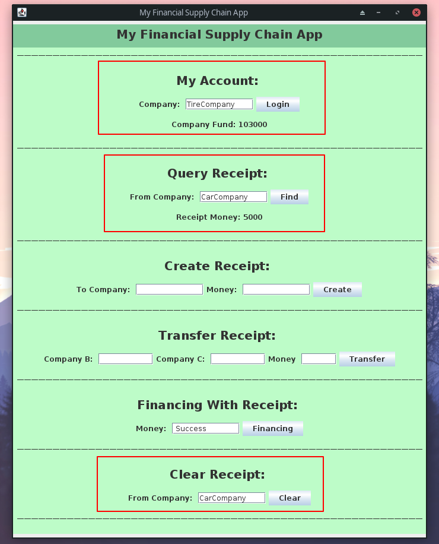

# 区块链实验报告

> github：https://github.com/zzm99/FISCO_BCOS_PROJECT

- 郑卓民 18342138	
- 张展邦 18342134	
- 颜府 18342113

## 项目背景

基于已有的开源区块链系统FISCO-BCOS（https://github.com/FISCOBCOS/FISCO-BCOS），以联盟链为主，开发基于区块链或区块链智能合约的供应链金融平台，实现供应链应收账款资产的溯源、流转。

### 场景介绍


**传统供应链金融：**

某车企（宝马）因为其造车技术特别牛，消费者口碑好，所以其在同行业中占据绝对优势地位。因此，在金融机构（银行）对该车企的信用评级将很高，认为他有很大的风险承担的能力。在某次交易中，该车企从轮胎公司购买了一批轮胎，但由于资金暂时短缺向轮胎公司签订了 1000 万的应收账款单据，承诺 1 年后归还轮胎公司 1000 万。这个过程可以拉上金融机构例如银行来对这笔交易作见证，确认这笔交易的真实性。在接下里的几个月里，轮胎公司因为资金短缺需要融资，这个时候它可以凭借跟某车企签订的应收账款单据向金融机构借款，金融机构认可该车企（核心企业）的还款能力，因此愿意借款给轮胎公司。但是，这样的信任关系并不会往下游传递。在某个交易中，轮胎公司从轮毂公司购买了一批轮毂，但由于租金暂时短缺向轮胎公司签订了 500 万的应收账款单据，承诺 1 年后归还轮胎公司 500万。当轮毂公司想利用这个应收账款单据向金融机构借款融资的时候，金融机构因为不认可轮胎公司的还款能力，需要对轮胎公司进行详细的信用分析以评估其还款能力同时验证应收账款单据的真实性，才能决定是否借款给轮毂公司。这个过程将增加很多经济成本，而这个问题主要是由于该车企的信用无法在整个供应链中传递以及交易信息不透明化所导致的。

**区块链+供应链金融：**

将供应链上的每一笔交易和应收账款单据上链，同时引入第三方可信机构来确认这些信息的交易，例如银行，物流公司等，确保交易和单据的真实性。同时，支持应收账款的转让，融资，清算等，让核心企业的信用可以传递到供应链的下游企业，减小中小企业的融资难度。

**实现功能：**

基本功能如下：
- 功能一：实现采购商品—签发应收账款交易上链。例如车企从轮胎公司购买一批轮胎并签订应收账款单据。
- 功能二：实现应收账款的转让上链，轮胎公司从轮毂公司购买一笔轮毂，便将于车企的应收账款单据部分转让给轮毂公司。轮毂公司可以利用这个新的单据去融资或者要求车企到期时归还钱款。
- 功能三：利用应收账款向银行融资上链，供应链上所有可以利用应收账款单据向银行申请融资。
- 功能四：应收账款支付结算上链，应收账款单据到期时核心企业向下游企业支付相应的欠款。

此外，完成加分项如下：
- 前端：友好高效的用户界面。

## 项目设计

### 链端

私有链的搭建过程在前期热身报告中即已完成，即使用如下命令：

- `bash build_chain.sh -l 127.0.0.1:4 -p 30300,20200,8545` : 生成一条单群组4节点的FISCO链。
- `bash nodes/127.0.0.1/start_all.sh` : 启动FISCO BCOS链，启动所有节点。

创建的项目使用的是FISCO文档教程中的asset-app项目，或者说它提供了一个框架效果，对于该框架的使用，主要修改tool文件夹下asset_run.sh文件中的最后一行，改为`java -Djdk.tls.namedGroups="secp256k1" -cp 'apps/*:conf/:lib/*' org.fisco.bcos.asset.client.MyChainApp $@`，其中MyChainApp即项目的启动文件。

此外，需要将相关证书复制到项目对应位置。

最后，就是要将编写好的solidity智能合约，以及用web3j对solidity进行转换后的java文件，放到对应的位置。

下面对solidity智能合约部分进行讲解，详述已在项目设计文档中说明，以及solidity智能合约在控制台上的部署和调用效果已在功能测试文档中说明。

#### 数据结构设计

- 企业数据结构

```js
// 企业数据结构
struct Company {
    uint256 company_id;		// 企业ID
    string company_name;	// 企业名称
    address company_address;	// 企业“地址”
    uint256 company_fund;		// 企业资产
    uint256 company_receipts_in;	// 单据收入（别人欠我的钱）
    uint256 company_receipts_out;	// 单据支出（我欠别人的钱）
    mapping (address => Receipt) receipts;	// 企业账款单据表（谁欠我钱）
}
```

- 账款单据数据结构

```js
// 账款单据数据结构： from 欠 to 钱 money
struct Receipt {
    bool valid;		// 有效标志
    address from;	// 来源企业“地址”
    address to;		// 传入企业“地址”
    uint256 money;	// 账款单据金额
}
```

#### 函数方法设计

##### 基础信息调用方法：

- 获取企业的资产

```js
// 获取企业的资产
function getCompanyFund(string company_name) public returns(string) {
    return Int2String(Address2Company[String2Address[stringToBytes32(company_name)]].company_fund);
}
```

- 获取企业的单据收入

```js
// 获取企业的单据收入
function getCompanyReceiptIn(string company_name) public returns(string) {
    return Int2String(Address2Company[String2Address[stringToBytes32(company_name)]].company_receipts_in);
}
```

- 获取企业的单据支出

```js
// 获取企业的单据支出
function getCompanyReceiptOut(string company_name) public returns(string) {
	return Int2String(Address2Company[String2Address[stringToBytes32(company_name)]].company_receipts_out);
}
```

- 获取账款单据的金额

```js
// 获取账款单据的金额
function getReceiptMoney(string from_company, string to_company) public returns(string) {
	address from_company_address = String2Address[stringToBytes32(from_company)];
	address to_company_address = String2Address[stringToBytes32(to_company)];

	if(Address2Company[to_company_address].receipts[from_company_address].valid) {
		return Int2String(Address2Company[to_company_address].receipts[from_company_address].money);
	}
    
	return "0";
}
```

##### 功能一：实现采购商品—签发应收账款交易上链。例如车企从轮胎公司购买一批轮胎并签订应收账款单据。

此部分就是创建一个单据，其中标明了A公司应该给B公司多少钱。

根据企业、单据数据结构的设计，创建单据的同时，还需要修改企业对象结构中的部分信息，例如支出方的应支出金额要增加、收入方的应收入金额要增加。

下面方法的调用方法如下：

假设车企从轮胎公司购买一批轮胎并签订应收账款单据，则调用`createReceipt(CarCompany, TireCompany, money)`。

```js
// 生成单据
function createReceipt(string from_company, string to_company, int money_int) public {
	uint256 money = uint256(money_int);
	address from_company_address = String2Address[stringToBytes32(from_company)];
	address to_company_address = String2Address[stringToBytes32(to_company)];

	if(Address2Company[to_company_address].receipts[from_company_address].valid) {
		Address2Company[to_company_address].receipts[from_company_address].money += money;
	} else {
		Address2Company[to_company_address].receipts[from_company_address] = Receipt(true, from_company_address, to_company_address, money);
	}

	Address2Company[from_company_address].company_receipts_out += money;
	Address2Company[to_company_address].company_receipts_in += money;
}
```

##### 功能二：实现应收账款的转让上链，轮胎公司从轮毂公司购买一笔轮毂，便将于车企的应收账款单据部分转让给轮毂公司。轮毂公司可以利用这个新的单据去融资或者要求车企到期时归还钱款。

此部分就是拆分一个已有单据，进行转让。

根据企业、单据数据结构的设计，除了更新三个企业各自的单据应付/应收信息外，还需要更新他们之间的单据情况。

此外，还需要注意，对于一些条件的判断，例如转让的金额是否已经超过了单据的金额。

下面方法的调用方法如下：

假设轮胎公司从轮毂公司购买一笔轮毂，便将于车企的应收账款单据部分转让给轮毂公司。轮毂公司可以利用这个新的单据去融资或者要求车企到期时归还钱款。

则调用`transferReceipt(TireCompany, CarCompany, HubCompany, money)`。


```js
// 自定金额的单据转移: B 欠 A 钱，A 转移其中部分或全部给C，使得B 也欠C钱
function transferReceipt(string company_A, string company_B, string company_C, int money_int) public returns(string){
	uint256 money = uint256(money_int);
	address company_A_address = String2Address[stringToBytes32(company_A)];
	address company_B_address = String2Address[stringToBytes32(company_B)];
	address company_C_address = String2Address[stringToBytes32(company_C)];
		
	if(Address2Company[company_A_address].receipts[company_B_address].valid == false) {
		return "Failure";
	}

	if(Address2Company[company_A_address].receipts[company_B_address].money < money) {
		return "Failure";
	}

	Address2Company[company_A_address].receipts[company_B_address].money -= money;
	if(Address2Company[company_A_address].receipts[company_B_address].money == 0) {
		Address2Company[company_A_address].receipts[company_B_address].valid = false;
	}
	Address2Company[company_A_address].company_receipts_in -= money;

	if(Address2Company[company_C_address].receipts[company_B_address].valid) {
		Address2Company[company_C_address].receipts[company_B_address].money += money;
	} else {
		Address2Company[company_C_address].receipts[company_B_address] = Receipt(true, company_B_address, company_C_address, money);
	}
	Address2Company[company_C_address].company_receipts_in += money;

	return "Success";
}
```

##### 功能三：利用应收账款向银行融资上链，供应链上所有可以利用应收账款单据向银行申请融资。

此部分就是利用自己拥有的单据（欠条），向银行融资（拿钱）。

需要更新银行和融资企业各自的单据信息。

此外，还需要注意，对于一些条件的判断，例如融资的金额是否超过了企业单据能收入的金额、银行是否有那么多现金资产。

下面方法的调用方法如下：

假设轮胎公司利用应收账款单据向银行申请融资。

则调用`financingWithReceipt(CarCompany, money)`。

```js
// 凭借别人给我的欠条单据来向银行拿钱
function financingWithReceipt(string company_name, int money_int) public returns(string) {
	uint256 money = uint256(money_int);
	address cur_company_address = String2Address[stringToBytes32(company_name)];
	address bank_company_address = String2Address[stringToBytes32("Bank")];

	if(Address2Company[cur_company_address].company_receipts_in < money || Address2Company[bank_company_address].company_fund < money) {
		return "Failure";
	}

	if(Address2Company[bank_company_address].receipts[cur_company_address].valid) {
		Address2Company[bank_company_address].receipts[cur_company_address].money += money;
	} else {
		Address2Company[bank_company_address].receipts[cur_company_address] = Receipt(true, cur_company_address, Address2Company[bank_company_address].company_address, money);
	}
	Address2Company[cur_company_address].company_receipts_out += money;
	Address2Company[cur_company_address].company_fund += money;
    Address2Company[bank_company_address].company_receipts_in += money;
	Address2Company[bank_company_address].company_fund -= money;
	return "Success";
}
```

##### 功能四：应收账款支付结算上链，应收账款单据到期时核心企业向下游企业支付相应的欠款。

此部分就是两个企业之间进行清理单据，A企业偿还B企业该付的钱。

需要更新企业各自的现金资产、单据情况。

此外，还需要注意，对于一些条件的判断，例如企业的现金资产是否大于单据的应付金额。

下面方法的调用方法如下：

假设轮胎公司偿还轮毂公司账款单据。

则调用`clearReceipt(TireCompany, HubCompany)`。

```js
// 履行账款单据，清除欠款
function clearReceipt(string from_company, string to_company) public returns(string) {
	address from_company_address = String2Address[stringToBytes32(from_company)];
	address to_company_address = String2Address[stringToBytes32(to_company)];

	if(Address2Company[to_company_address].receipts[from_company_address].valid == false) {
		return "Failure";
	}

	if(Address2Company[from_company_address].company_fund < Address2Company[to_company_address].receipts[from_company_address].money) {
		return "Failure";			
	}

	uint256 receipt_money = Address2Company[to_company_address].receipts[from_company_address].money;
	Address2Company[to_company_address].receipts[from_company_address].money = 0;
	Address2Company[to_company_address].receipts[from_company_address].valid = false;
	Address2Company[to_company_address].company_fund += receipt_money;
	Address2Company[to_company_address].company_receipts_in -= receipt_money;
	Address2Company[from_company_address].company_fund -= receipt_money;
	Address2Company[from_company_address].company_receipts_out -= receipt_money;
	return "Success";
}
```

### 后端

后端代码位于MyChainControl.java中。其结构参考了demo中的AssetClient.java中的代码构造。函数方法主要分为以下几个功能：

- MyChainApp的初始化，智能合约的部署：

其中的initialize和deployAssetAndRecordAddr即沿用了demo中AssetClient中的方法。

```java
public void myChainInit() {
	try {
		initialize();
		deployAssetAndRecordAddr();
		String contractAddr = loadAssetAddr();
        FinancialSupplyChain contr = FinancialSupplyChain.load(contractAddr, web3j, credentials, gasPrice, gasLimit);
	} catch (Exception e) {
		System.out.println("error: "+e.getMessage());
	}
}
```

接着，就是封装对于智能合约中设定的功能的调用：

- 获取企业资金：

```java
public String getCompanyFundControl() {
    try {
		String contractAddr = loadAssetAddr();
        FinancialSupplyChain contr = FinancialSupplyChain.load(contractAddr, web3j, credentials, gasPrice, gasLimit);
        TransactionReceipt result = contr.getCompanyFund(username).send();
        return formatInt(result.getOutput());
	} catch (Exception e) {
		System.out.println("error: "+e.getMessage());
    }
    return "0";
}
```

- 获取账款单据的金额：

```java
public String getReceiptMoneyControl(String from_company) {
    try {
		String contractAddr = loadAssetAddr();
        FinancialSupplyChain contr = FinancialSupplyChain.load(contractAddr, web3j, credentials, gasPrice, gasLimit);
        TransactionReceipt result = contr.getReceiptMoney(from_company, username).send();
        return formatInt(result.getOutput());
	} catch (Exception e) {
		System.out.println("error: "+e.getMessage());
    }
    return "0";
}
```

- 创建一个账款单据：

```java
public void createReceiptControl(String to_company, int money) { 
    try {
		String contractAddr = loadAssetAddr();
        FinancialSupplyChain contr = FinancialSupplyChain.load(contractAddr, web3j, credentials, gasPrice, gasLimit);
    	contr.createReceipt(username, to_company, BigInteger.valueOf(money)).send();
	} catch (Exception e) {
		System.out.println("error: "+e.getMessage());
	}
}
```

- 账款单据的转让：

```java
public void transferReceiptControl(String company_B, String company_C, int money) {
    try {
		String contractAddr = loadAssetAddr();
        FinancialSupplyChain contr = FinancialSupplyChain.load(contractAddr, web3j, credentials, gasPrice, gasLimit);
        contr.transferReceipt(username, company_B, company_C, BigInteger.valueOf(money)).send();
	} catch (Exception e) {
		System.out.println("error: "+e.getMessage());
	}
}
```

- 利用账款单据融资：

```java
public String financingWithReceiptControl(int money) {
    try {
		String contractAddr = loadAssetAddr();
        FinancialSupplyChain contr = FinancialSupplyChain.load(contractAddr, web3j, credentials, gasPrice, gasLimit);
        TransactionReceipt result = contr.financingWithReceipt(username, BigInteger.valueOf(money)).send();
        return formatWord(result.getOutput());
	} catch (Exception e) {
		System.out.println("error: "+e.getMessage());
    }
    return "false";
}
```

- 账款单据的清理（偿还/收款）：

```java
public String clearReceiptControl(String from_company) {
    try {
		String contractAddr = loadAssetAddr();
        FinancialSupplyChain contr = FinancialSupplyChain.load(contractAddr, web3j, credentials, gasPrice, gasLimit);
        TransactionReceipt result = contr.clearReceipt(from_company, username).send();
        return formatWord(result.getOutput());
	} catch (Exception e) {
		System.out.println("error: "+e.getMessage());
    }
    return "false";
}
```


### 前端

前端的代码位于MyChainApp.java中，主要的功能即布局一个UI界面，设置一些Button用于与用户交互，并绑定对应的函数，调用对应的上面后端中写好的功能，然后刷新相关显示数据。

主要用到了java的swingUI布局。

关键代码如下：

其中调用了六个XXPanel方法，是对App各个主要功能的UI界面设置布局。

```java
public MyChainApp() {
	super("My Financial Supply Chain App");
	this.setSize(700, 900);
	this.setBackground(new Color(189,252,200));
	setDefaultCloseOperation(JFrame.EXIT_ON_CLOSE);
	this.setLayout(new GridLayout(22, 5));

	myAccountPanel();
	queryReceiptPanel();
	createReceiptPanel();
	transferReceiptPanel();
	financingPanel();
	clearReceiptPanel();

	this.setVisible(true);
	myChain = new MyChainControl();
	myChain.myChainInit();
}
```

## 项目运行

首先需要将链端的节点全部打开，参考文档中运行start_all.sh的方法。

接着就可以对项目进行构建了，在asset-app文件夹目录下，执行`./gradlew build`，然后进入dist文件夹，执行`bash asset_run.sh deploy`即可。

运行效果如下：



功能测试过程仿照案例图中的场景：

- 银行初始化有100万资金，其他各公司初始化有10万资金


- 汽车公司创建账单给轮胎公司，轮胎公司应收10000元


- 轮胎公司转让与汽车公司的账单中的5000元给轮毂公司


- 轮毂公司转让与汽车公司的账单（刚刚从轮胎公司中转让过来的）中的1000元给铝锭公司


- 铝锭公司转让与汽车公司的账单（刚刚从轮毂公司中转让过来的）中的500元给铝锭公司


- 轮胎公司凭借剩下的5000元账单，向银行融资3000元


- 轮毂公司凭借剩下的4000元账单，向银行融资2000元


- 铝锭公司凭借剩下的500元账单，向银行融资300元


- 铝框公司凭借拥有的500元账单，向银行融资300元


- 各公司融资完后，银行剩余的资金：1000000-3000-2000-300-300=994400


- 汽车公司偿还轮胎公司5000元账单




## 问题/总结反馈

FISCO-BCOS文档中说明了支持的开发环境是Mac、Ubuntu、CentOS，实际实践发现应该只要是Unix、Liunx系统即可，本项目使用的环境是Manjaro Linux环境。

项目的部分依赖的下载可能需要用到外网环境，解决方法一是直接去网站下载文件包，二是找镜像文件。

在本次项目以及FISCO-BCOS上给的教程项目中使用到的Java文件都是使用web3j来进行solidity到java的转换的，而fisco提供的工具里面只有sdk来进行solidity到java的转换，因此需要下载web3j，而web3j的下载是需要到外网的，可以选择在windows环境下将solidity转换为java然后再将对应文件添加到linux环境下的项目中。

