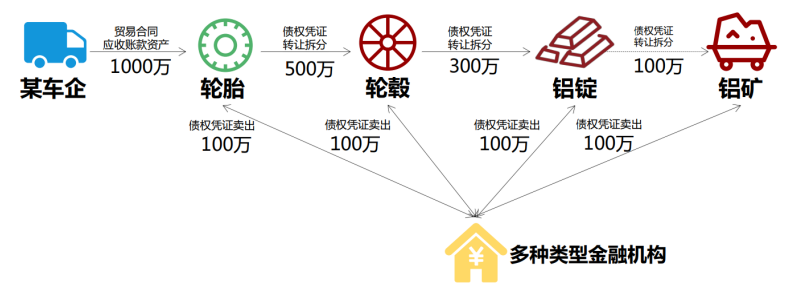

# 项目设计说明

- 郑卓民 18342138	
- 张展邦 18342134	
- 颜府 18342113

<!-- TOC -->

- [项目设计说明](#项目设计说明)
	- [数据结构设计](#数据结构设计)
	- [函数方法设计](#函数方法设计)
		- [基础信息调用方法：](#基础信息调用方法)
		- [功能一：实现采购商品—签发应收账款交易上链。例如车企从轮胎公司购买一批轮胎并签订应收账款单据。](#功能一实现采购商品签发应收账款交易上链例如车企从轮胎公司购买一批轮胎并签订应收账款单据)
		- [功能二：实现应收账款的转让上链，轮胎公司从轮毂公司购买一笔轮毂，便将于车企的应收账款单据部分转让给轮毂公司。轮毂公司可以利用这个新的单据去融资或者要求车企到期时归还钱款。](#功能二实现应收账款的转让上链轮胎公司从轮毂公司购买一笔轮毂便将于车企的应收账款单据部分转让给轮毂公司轮毂公司可以利用这个新的单据去融资或者要求车企到期时归还钱款)
		- [功能三：利用应收账款向银行融资上链，供应链上所有可以利用应收账款单据向银行申请融资。](#功能三利用应收账款向银行融资上链供应链上所有可以利用应收账款单据向银行申请融资)
		- [功能四：应收账款支付结算上链，应收账款单据到期时核心企业向下游企业支付相应的欠款。](#功能四应收账款支付结算上链应收账款单据到期时核心企业向下游企业支付相应的欠款)

<!-- /TOC -->

> 根据提供的供应链场景，基于 FISCO-BCOS 设计相关的智能合约并详细解释智能合约是如何解决提出的问题。



## 数据结构设计

- 企业数据结构

```js
// 企业数据结构
struct Company {
    uint256 company_id;		// 企业ID
    string company_name;	// 企业名称
    address company_address;	// 企业“地址”
    uint256 company_fund;		// 企业资产
    uint256 company_receipts_in;	// 单据收入（别人欠我的钱）
    uint256 company_receipts_out;	// 单据支出（我欠别人的钱）
    mapping (address => Receipt) receipts;	// 企业账款单据表（谁欠我钱）
}
```

- 账款单据数据结构

```js
// 账款单据数据结构： from 欠 to 钱 money
struct Receipt {
    bool valid;		// 有效标志
    address from;	// 来源企业“地址”
    address to;		// 传入企业“地址”
    uint256 money;	// 账款单据金额
}
```

## 函数方法设计

### 基础信息调用方法：

- 获取企业的资产

```js
// 获取企业的资产
function getCompanyFund(string company_name) public returns(string) {
    return Int2String(Address2Company[String2Address[stringToBytes32(company_name)]].company_fund);
}
```

- 获取企业的单据收入

```js
// 获取企业的单据收入
function getCompanyReceiptIn(string company_name) public returns(string) {
    return Int2String(Address2Company[String2Address[stringToBytes32(company_name)]].company_receipts_in);
}
```

- 获取企业的单据支出

```js
// 获取企业的单据支出
function getCompanyReceiptOut(string company_name) public returns(string) {
	return Int2String(Address2Company[String2Address[stringToBytes32(company_name)]].company_receipts_out);
}
```

- 获取账款单据的金额

```js
// 获取账款单据的金额
function getReceiptMoney(string from_company, string to_company) public returns(string) {
	address from_company_address = String2Address[stringToBytes32(from_company)];
	address to_company_address = String2Address[stringToBytes32(to_company)];

	if(Address2Company[to_company_address].receipts[from_company_address].valid) {
		return Int2String(Address2Company[to_company_address].receipts[from_company_address].money);
	}
    
	return "0";
}
```

### 功能一：实现采购商品—签发应收账款交易上链。例如车企从轮胎公司购买一批轮胎并签订应收账款单据。

此部分就是创建一个单据，其中标明了A公司应该给B公司多少钱。

根据企业、单据数据结构的设计，创建单据的同时，还需要修改企业对象结构中的部分信息，例如支出方的应支出金额要增加、收入方的应收入金额要增加。

下面方法的调用方法如下：

假设车企从轮胎公司购买一批轮胎并签订应收账款单据，则调用`createReceipt(CarCompany, TireCompany, money)`。

```js
// 生成单据
function createReceipt(string from_company, string to_company, int money_int) public {
	uint256 money = uint256(money_int);
	address from_company_address = String2Address[stringToBytes32(from_company)];
	address to_company_address = String2Address[stringToBytes32(to_company)];

	if(Address2Company[to_company_address].receipts[from_company_address].valid) {
		Address2Company[to_company_address].receipts[from_company_address].money += money;
	} else {
		Address2Company[to_company_address].receipts[from_company_address] = Receipt(true, from_company_address, to_company_address, money);
	}

	Address2Company[from_company_address].company_receipts_out += money;
	Address2Company[to_company_address].company_receipts_in += money;
}
```

### 功能二：实现应收账款的转让上链，轮胎公司从轮毂公司购买一笔轮毂，便将于车企的应收账款单据部分转让给轮毂公司。轮毂公司可以利用这个新的单据去融资或者要求车企到期时归还钱款。

此部分就是拆分一个已有单据，进行转让。

根据企业、单据数据结构的设计，除了更新三个企业各自的单据应付/应收信息外，还需要更新他们之间的单据情况。

此外，还需要注意，对于一些条件的判断，例如转让的金额是否已经超过了单据的金额。

下面方法的调用方法如下：

假设轮胎公司从轮毂公司购买一笔轮毂，便将于车企的应收账款单据部分转让给轮毂公司。轮毂公司可以利用这个新的单据去融资或者要求车企到期时归还钱款。

则调用`transferReceipt(TireCompany, CarCompany, HubCompany, money)`。


```js
// 自定金额的单据转移: B 欠 A 钱，A 转移其中部分或全部给C，使得B 也欠C钱
function transferReceipt(string company_A, string company_B, string company_C, int money_int) public returns(string){
	uint256 money = uint256(money_int);
	address company_A_address = String2Address[stringToBytes32(company_A)];
	address company_B_address = String2Address[stringToBytes32(company_B)];
	address company_C_address = String2Address[stringToBytes32(company_C)];
		
	if(Address2Company[company_A_address].receipts[company_B_address].valid == false) {
		return "Failure";
	}

	if(Address2Company[company_A_address].receipts[company_B_address].money < money) {
		return "Failure";
	}

	Address2Company[company_A_address].receipts[company_B_address].money -= money;
	if(Address2Company[company_A_address].receipts[company_B_address].money == 0) {
		Address2Company[company_A_address].receipts[company_B_address].valid = false;
	}
	Address2Company[company_A_address].company_receipts_in -= money;

	if(Address2Company[company_C_address].receipts[company_B_address].valid) {
		Address2Company[company_C_address].receipts[company_B_address].money += money;
	} else {
		Address2Company[company_C_address].receipts[company_B_address] = Receipt(true, company_B_address, company_C_address, money);
	}
	Address2Company[company_C_address].company_receipts_in += money;

	return "Success";
}
```

### 功能三：利用应收账款向银行融资上链，供应链上所有可以利用应收账款单据向银行申请融资。

此部分就是利用自己拥有的单据（欠条），向银行融资（拿钱）。

需要更新银行和融资企业各自的单据信息。

此外，还需要注意，对于一些条件的判断，例如融资的金额是否超过了企业单据能收入的金额、银行是否有那么多现金资产。

下面方法的调用方法如下：

假设轮胎公司利用应收账款单据向银行申请融资。

则调用`financingWithReceipt(CarCompany, money)`。

```js
// 凭借别人给我的欠条单据来向银行拿钱
function financingWithReceipt(string company_name, int money_int) public returns(string) {
	uint256 money = uint256(money_int);
	address cur_company_address = String2Address[stringToBytes32(company_name)];
	address bank_company_address = String2Address[stringToBytes32("Bank")];

	if(Address2Company[cur_company_address].company_receipts_in < money || Address2Company[bank_company_address].company_fund < money) {
		return "Failure";
	}

	if(Address2Company[bank_company_address].receipts[cur_company_address].valid) {
		Address2Company[bank_company_address].receipts[cur_company_address].money += money;
	} else {
		Address2Company[bank_company_address].receipts[cur_company_address] = Receipt(true, cur_company_address, Address2Company[bank_company_address].company_address, money);
	}
	Address2Company[cur_company_address].company_receipts_out += money;
	Address2Company[cur_company_address].company_fund += money;
    Address2Company[bank_company_address].company_receipts_in += money;
	Address2Company[bank_company_address].company_fund -= money;
	return "Success";
}
```

### 功能四：应收账款支付结算上链，应收账款单据到期时核心企业向下游企业支付相应的欠款。

此部分就是两个企业之间进行清理单据，A企业偿还B企业该付的钱。

需要更新企业各自的现金资产、单据情况。

此外，还需要注意，对于一些条件的判断，例如企业的现金资产是否大于单据的应付金额。

下面方法的调用方法如下：

假设轮胎公司偿还轮毂公司账款单据。

则调用`clearReceipt(TireCompany, HubCompany)`。

```js
// 履行账款单据，清除欠款
function clearReceipt(string from_company, string to_company) public returns(string) {
	address from_company_address = String2Address[stringToBytes32(from_company)];
	address to_company_address = String2Address[stringToBytes32(to_company)];

	if(Address2Company[to_company_address].receipts[from_company_address].valid == false) {
		return "Failure";
	}

	if(Address2Company[from_company_address].company_fund < Address2Company[to_company_address].receipts[from_company_address].money) {
		return "Failure";			
	}

	uint256 receipt_money = Address2Company[to_company_address].receipts[from_company_address].money;
	Address2Company[to_company_address].receipts[from_company_address].money = 0;
	Address2Company[to_company_address].receipts[from_company_address].valid = false;
	Address2Company[to_company_address].company_fund += receipt_money;
	Address2Company[to_company_address].company_receipts_in -= receipt_money;
	Address2Company[from_company_address].company_fund -= receipt_money;
	Address2Company[from_company_address].company_receipts_out -= receipt_money;
	return "Success";
}
```